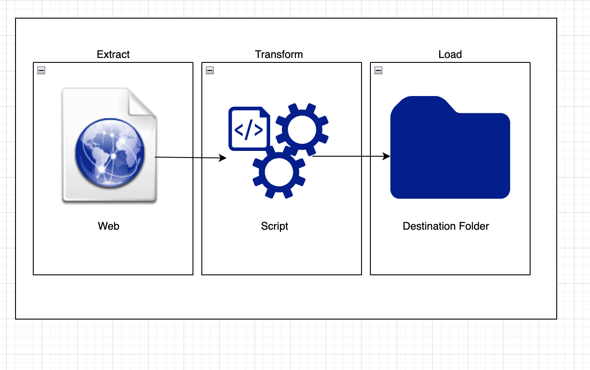

## Bash and SQL Scripts for CDE- Assignment
The bash script downloads a csv file, changes a column and extract needed columns, loads the transformed columns to a different folder.
The entire extraction, transformation and loading were done using bash commands.

## Scheduling
Schedules using a cron job that runs everyday at 12 by opening the 
cron tab -e to open
entered this cron character to specify the time specifically 0 hrs at 0am daily: 0 0  * * * /Users/mac/Desktop/CDE/etl-script.sh
confirmed by listing the cron jobs using cron -l

### Bulk Move
moved all .csv and .json files using mv command to a folder created specifically for files with that extension

## Bash Script to create a postgres database, iterate over multiple csv files and move the files to the database
This Bash script automates the process of importing multiple CSV files with varying table structures into a PostgreSQL database. It creates the database, then the tables dynamically based on the column names and infers the column data types by sampling the content of each CSV file.

## SQL Scripts
Scripts to query the tables including Joins, where clases, special characters, etc
